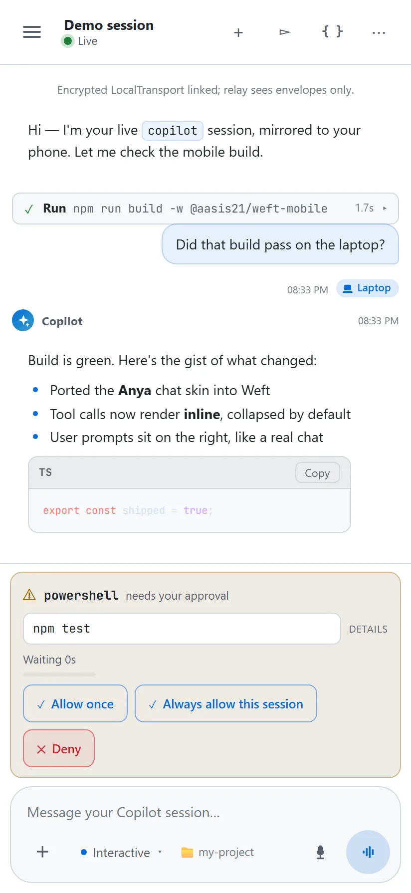
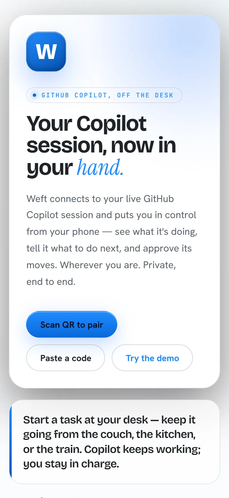
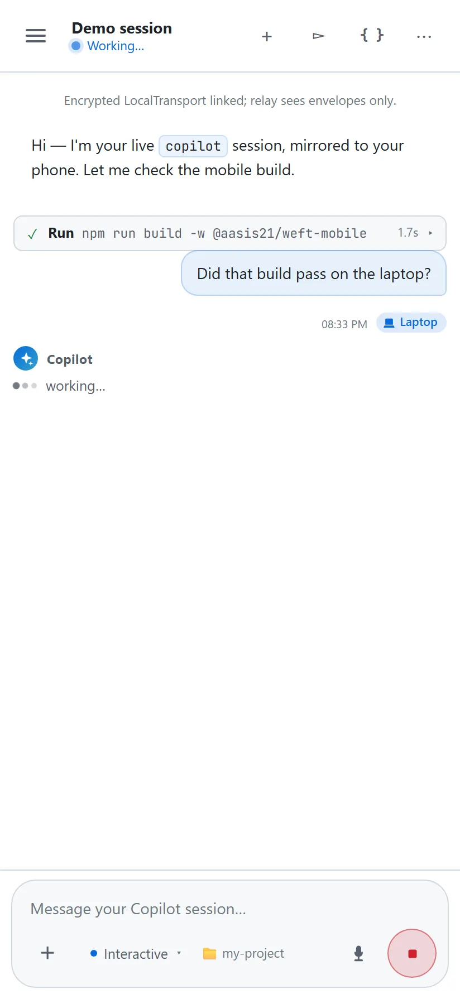

<div align="center">

# Weft

**Your Copilot session, off the desk.**

[](LICENSE)
[](#quick-start)
[](https://github.com/github/copilot-cli)

Weft mirrors your live GitHub Copilot terminal session to your phone over an end-to-end
encrypted relay — watch it work, approve its moves, talk back, from anywhere.

**[✨ Live site → aasis21.github.io/weft](https://aasis21.github.io/weft/)** · **[Try the web app → useweft.netlify.app](https://useweft.netlify.app)**



</div>

|  |  |  |
|---|---|---|
| <br>**Pair in seconds** | <br>**Watch it work** | <br>**Approve from anywhere** |

> **Try it now (no install):** **<https://useweft.netlify.app>** — open on your phone,
> scan the pairing QR your terminal prints (or paste it), and you're bound to the session.

### Install the extension on your laptop

One line. Downloads the prebuilt extension into `~/.copilot/extensions/weft/` (where
Copilot CLI auto-discovers it) plus a "how to use Weft" skill into
`~/.copilot/skills/weft-how-to-use/`, pre-wired to the hosted relay — no clone, no Node build:

```powershell
# Windows (PowerShell)
irm https://useweft.netlify.app/install.ps1 | iex
```

```bash
# macOS / Linux
curl -fsSL https://useweft.netlify.app/install.sh | bash
```

Then start `copilot` in any repo, open **<https://useweft.netlify.app>** on your phone,
scan the QR (or run `/weft` to re-show it), and approve/deny from anywhere.

- **Zero-config** — uses the creator's hosted relay (a client-safe publishable key + RLS +
  end-to-end AES-256-GCM; Supabase only ever sees ciphertext).
- **Run your own relay** — installer flags let you point at your own Supabase project:
  `... | iex` becomes
  `& ([scriptblock]::Create((irm https://useweft.netlify.app/install.ps1))) -SupabaseUrl <url> -SupabaseKey <key>`
  on Windows, or `WEFT_SUPABASE_URL=<url> WEFT_SUPABASE_ANON_KEY=<key> bash -c "$(curl -fsSL https://useweft.netlify.app/install.sh)"` on Unix.
  Prefer building from source? Use [`setup.ps1` / `setup.sh`](docs/setup.md).
- **Uninstall** — delete `~/.copilot/extensions/weft/`, `~/.copilot/skills/weft-how-to-use/`, and
  `~/.weft/` (your config: `weft.config.json` — registered projects, transport choice).

> Sibling project to [`aasis21/vox`](https://github.com/aasis21/vox),
> [`aasis21/anya`](https://github.com/aasis21/anya), and
> [`aasis21/engram`](https://github.com/aasis21/engram).

---

## Commands

| Command | What it does |
|---|---|
| `weft start` | Start the Device Station and print a QR to pair from your phone. |
| `weft add-project <name> <path> [--default]` | Register a project directory Weft can launch sessions in. |
| `weft remove-project <name>` | Forget a registered project. |
| `weft list-projects` | List registered projects and which one is default. |
| `weft set-default <name>` | Choose the project a bare pairing launches into. |
| `weft set-transport <supabase\|devtunnel\|clear> [--url <url>] [--anon-key <key>]` | Choose (or clear) the pairing transport. |
| `weft show-transport` | Print the transport currently in effect and where it came from. |
| `weft set-name <name>` | Set the display name this device shows to your phone (DEVICES list). Defaults to your OS hostname until set. |
| `weft show-name` | Print the device name currently in effect and where it came from. |
| `weft devtunnel start` | Bring up the shared devtunnel relay (prerequisite before pairing when the transport is `devtunnel`). Provisions on first run or reuses an already-running one; blocks with a live status line. |
| `weft devtunnel status` | Check whether the shared devtunnel relay is running, without starting it. |
| `weft devtunnel stop` | Tear down the shared devtunnel relay. |
| `weft help` | Show usage. |

---

## Architecture

```
+------------------------------+        +------------------------------+        +-------------------------------+
| Weft Mobile                  |        |   Supabase Realtime          |        |  Laptop terminal              |
| (React + Capacitor, Android) |        |   Broadcast channel          |        |  copilot (parent)             |
|                              |        |   private:weft:<channelId>   |        |   └─ extension.mjs (child)    |
|  • scans QR (channel + pub)  |  WSS   |   • in-memory pub/sub        |  WSS   |   • joinSession()             |
|  • ECDH → AES-256-GCM        | <----> |   • zero DB persistence      | <----> |   • onPermissionRequest→relay |
|  • decrypts token stream     |        |   • RLS-gated private chan   |        |   • on(assistant.message)→push|
|  • native-style approval UI  |        |                              |        |   • session.send(phone prompt)|
|  • prompt + mode controls    |        |                              |        |   • QR via session.log()      |
+------------------------------+        +------------------------------+        +-------------------------------+
        all payloads E2E-encrypted; Supabase sees ciphertext only
```

Three layers, one monorepo:

| Workspace | What it is |
|---|---|
| `extension/` | The Copilot CLI extension (`joinSession`) + a local test **harness** that mimics the phone with no Supabase needed. |
| `shared/` | Contracts imported by **both** ends: message schema, E2E crypto (ECDH→AES-GCM), and a pluggable transport (LocalTransport now → SupabaseTransport later). |
| `mobile/` | React + Vite + Capacitor app (Android first); also ships as a hosted **web app** ([useweft.netlify.app](https://useweft.netlify.app)) with in-browser camera QR scanning. |

### Design principles
- **Approval = pure relay of native Copilot behavior.** The extension forwards the *native*
  permission prompt to the phone via `onPermissionRequest` and resolves with the user's tap. No
  custom policy. Only safety net: a configurable **timeout → deny** so a missing phone can't hang
  the agent.
- **Ephemeral relay.** Supabase Realtime Broadcast is in-memory; zero DB persistence in v1.
- **End-to-end encrypted.** ECDH key agreement (public key in the QR, no secret) → AES-256-GCM.
  Supabase only ever sees ciphertext.
- **stdout is sacred.** The CLI reserves stdout for JSON-RPC; all extension UX uses
  `session.log()`.

---

## Runtime & packaging model

- The extension is authored in `extension/src/` and bundled (esbuild) to a single
  `extension/dist/extension.mjs`. `@github/copilot-sdk` is marked **external** (the CLI provides
  it at runtime); everything else (e.g. `@supabase/supabase-js`, `shared/`) is bundled in.
- Install copies `extension/dist/` into `~/.copilot/extensions/weft/`, where Copilot CLI
  auto-discovers it (see `setup.*` / `install.*`) — that directory holds installed **code
  only**. All user config (relay `.env`, registered projects, transport choice) lives
  separately in `~/.weft/` (see `weftHome()` in `extension/src/projects.mjs`). Crypto uses
  Web Crypto — no native deps.
- For local development you do **not** need to install into `~/.copilot`: run the **harness**
  (`extension/harness/`) which drives the extension logic against `LocalTransport`.

---

## Quick start

```sh
npm install                                 # resolve workspaces (shared, extension, mobile)
npm test -w @aasis21/weft-shared            # crypto + pairing + transport + message tests
node extension/harness/harness.mjs --auto   # full relay loop vs a simulated phone (no Supabase)
npm run build -w @aasis21/weft-extension    # bundle -> extension/dist/extension.mjs
npm run build -w @aasis21/weft-mobile       # Vite production build
cd mobile && npm run dev                    # then pick "Demo / Simulator"
```

See [`docs/setup.md`](docs/setup.md) for the full developer guide.

| Doc | What |
|---|---|
| [`docs/setup.md`](docs/setup.md) | install, verify, run, and Supabase wiring |
| [`docs/pairing.md`](docs/pairing.md) | the ECDH pairing handshake |
| [`docs/security.md`](docs/security.md) | threat model & cryptography |
| [`docs/mode-switching.md`](docs/mode-switching.md) | runtime interactive/plan/autopilot switching |
| [`docs/hosting.md`](docs/hosting.md) | public instance vs self-hosting; operating a relay |

---

## Testing

`npm test` at the root fans out to every workspace. Tests come in two tiers that answer
**different questions**, so a change is proven where it's cheapest and most reliable:

| Tier | Runner | Lives in | Answers |
|---|---|---|---|
| **Contracts + extension** | `node:test` | `shared/**/*.test.mjs`, `extension/**/*.test.mjs` | Is the crypto / pairing / transport / message protocol and the extension relay logic correct? |
| **Mobile unit + scenario** | **Vitest** + jsdom | `mobile/src/**/*.test.{ts,tsx}` | Is the *logic* right for a given message / timer / edge — fast, deterministic, fully mocked? |
| **Mobile real-browser e2e** | **Playwright** | `mobile/tests/*.spec.ts` | Does the *real production build* render, scroll, and navigate for a user? |

**What goes where (mobile):**
- **Vitest = breadth.** The exhaustive scenario matrix — join, resume-dedupe, remove→re-join,
  network drop→catch-up, state snapshot, approvals, elicitations, streaming, the 20s/30s heartbeat
  watchdog, persistence-across-restart — drives the **real `SessionManager`** through a mocked
  transport (`FakeWeftClient`) with fake timers, so no network, crypto, or Supabase is touched. Plus
  pure-logic (`reduceTimeline`, `sessions`, `transcripts`, `storage`) and React component tests (RTL).
- **Playwright = depth.** A few *bigger journeys* against `dist/` in a real phone viewport (412×915),
  driven by the in-app demo simulator: `journey-connect` (Landing→Join→Session navigation),
  `journey-stream` (a live streaming turn), `journey-session-management` (drawer + leave-confirm +
  routing), and `journey-smoke` (production boot + layout). It answers what only a real browser can.
- **Not automated (manual):** the real Supabase relay + real WebCrypto E2E + real cross-device
  pairing. Vitest mocks the transport; Playwright uses the demo. Neither hits the network.

```sh
npm test                                   # all workspaces: shared + extension + mobile
npm test -w @aasis21/weft-mobile           # just the mobile Vitest unit/scenario suite
npm run coverage -w @aasis21/weft-mobile   # mobile coverage table (report-only, no gate)
npm run test:e2e -w @aasis21/weft-mobile   # build dist/ + run the Playwright journeys
```

---

## Status


**v1 built end-to-end, with a live hosted relay and web app.** The shared contracts (E2E
crypto, pairing handshake, message protocol, pluggable transport), the CLI extension
(`joinSession`, native permission relay, prompt injection, real `session.rpc.mode.set` mode
switching, on-device approval notifications, lifecycle), its local harness, and the
React/Capacitor app (pairing, live stream, approval cards, prompt composer, mode selector,
session-ended) all build and pass their checks. A real Supabase relay (RLS-gated Broadcast)
is provisioned and the app is deployed at **[useweft.netlify.app](https://useweft.netlify.app)**
with one-line installers for the laptop extension.

**Remaining:** a full real-device pass (physical phone ↔ laptop over the live relay), plus
hardening follow-ups (relay rate-limiting, replay sequence numbers). See the phased plan in
the session artifacts.

## License

[Apache-2.0](LICENSE) — permissive, with an explicit patent grant and trademark
reservation; see [`NOTICE`](NOTICE) for attribution. Operating a hosted relay is a
separate concern from the code license — see [`docs/hosting.md`](docs/hosting.md) and
[`TERMS.md`](TERMS.md).
