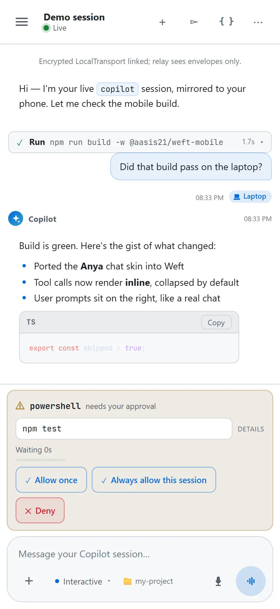
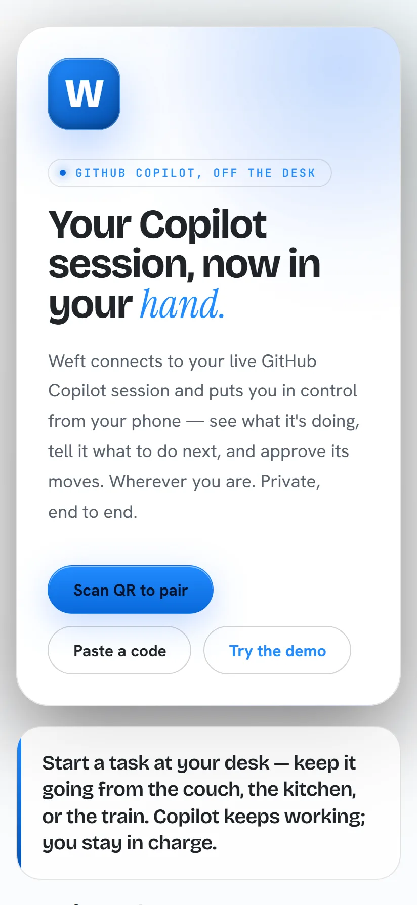
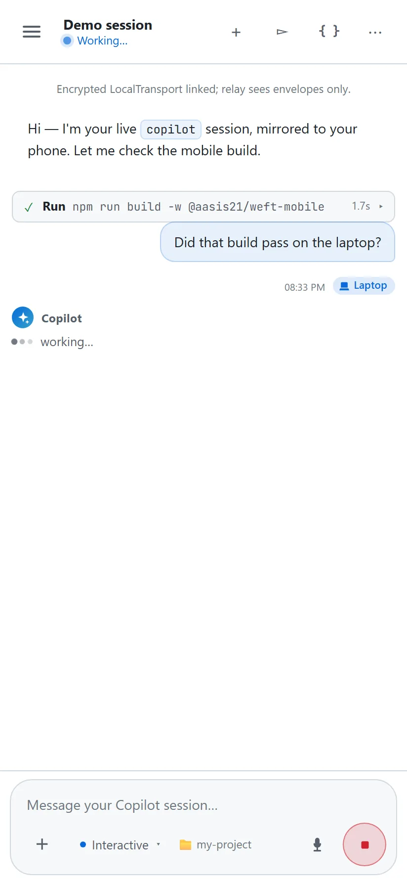

<div align="center">

# Weft

**Your Copilot session, off the desk.**

[](LICENSE)
[](#get-started)
[](https://github.com/github/copilot-cli)

Weft mirrors your live GitHub Copilot terminal session to your phone over an end-to-end
encrypted relay — watch it work, approve its moves, steer it by text or voice, and pick any
chat back up, from anywhere.

**[✨ Live site → aasis21.github.io/weft](https://aasis21.github.io/weft/)** · **[Try the web app → useweft.netlify.app](https://useweft.netlify.app)**



</div>

|  |  |  |
|---|---|---|
| <br>**Pair in seconds** | <br>**Watch it work** | <br>**Approve from anywhere** |

> **Fastest path:** install Weft on your laptop, run `weft start`, then open
> **<https://useweft.netlify.app>** on your phone and scan the QR.

## What you can do

Everything you'd do at the terminal — now from your phone:

- **Drive it live** — send prompts and follow-ups; replies stream back token by token. It's the
  real session, not a read-only mirror.
- **Watch it work** — every command it runs and file it edits, unfolding live in the thread.
- **Approve before it acts** — the *native* Copilot permission prompt is relayed to your phone;
  allow or deny with a tap. The prompt stays open until you answer or the session ends.
- **Go hands-free with Vox** — tap the waveform and just talk; the orb takes the keyboard's place in
  the composer, so the thread and any approval stay in view while Vox transcribes, sends, and reads
  the reply back. Expand it to the full-screen orb when you want to put the phone down.
- **Show it a screenshot** — attach up to six images from your camera, library, paste, or drag so
  it can *see* the bug, the design, the error.
- **Keep it on track** — steer an active turn, queue the next instruction, switch
  **interactive / plan / autopilot**, fire whitelisted slash commands (`/model`, `/compact`,
  `/clear`, `/autopilot`, …) that run on the laptop, or **Stop** a turn mid-run.
- **Run a fleet** — one Device Station drives many projects and sessions; start a fresh chat or tap
  into a running one, across multiple laptops with a default device.
- **Recover slow launches safely** — New and Resume requests survive phone reloads and temporary
  Devbox outages; **Try again** reconnects to the same launch instead of silently opening duplicates.
- **Come back anytime** — sessions stay warm and reconnect on reopen; archive, pin, and rename them,
  and juggle several at once.

All live session traffic flows over the same end-to-end-encrypted channel. Weft stores
transcripts, session metadata, and pairing keys locally on your devices so sessions can
reconnect; the relay infrastructure forwards encrypted envelopes and stores no session content.

## Get started

### 1. Install on your laptop

One line. Downloads the prebuilt extension into `~/.copilot/extensions/weft/` (where
Copilot CLI auto-discovers it) plus a "how to use Weft" skill into
`~/.copilot/skills/weft-how-to-use/`, pre-wired to the hosted relay — no clone, no Node build:

```powershell
# Windows (PowerShell)
irm https://useweft.netlify.app/install.ps1 | iex
```

```bash
# macOS / Linux
curl -fsSL https://useweft.netlify.app/install.sh | bash
```

### 2. Start Weft

```sh
weft start
```

Leave that terminal open. The Device Station prints a pairing QR and lets the phone start
or resume Copilot sessions on this laptop.

### 3. Scan from your phone

Open **<https://useweft.netlify.app>**, choose **Scan QR to pair**, and scan the code in
the terminal. The browser app works immediately; use **Install app** or **Add to Home
Screen** for an app-like experience and automatic web updates.

- **PWA distribution** — the hosted PWA is the supported phone experience. Native
  Android builds are currently developer builds only; Weft does not publish an APK
  until a signed Android release pipeline is available.
- **Zero-config** — uses the creator's hosted relay (a client-safe publishable key + RLS +
  end-to-end AES-256-GCM; Supabase only ever sees ciphertext).
- **Update safely** — `weft update --check` reports whether a hosted release is newer;
  `weft update` verifies the published hashes, replaces only installed code and the Weft
  skill, and leaves `~/.weft/` data untouched. Restart Copilot CLI or Device Station after.
- **Uninstall** — remove the installed extension and skill. Remove `~/.weft/` only if you
  also want to delete local configuration, registered projects, logs, and persistent
  pairing keys. See [`SUPPORT.md`](SUPPORT.md) for the exact cleanup paths.
- **Advanced options** — `/weft`, alternate transports, pairing lifetime, self-hosting,
  and the full command reference live in [`docs/advanced.md`](docs/advanced.md).

> Sibling project to [`aasis21/vox`](https://github.com/aasis21/vox),
> [`aasis21/anya`](https://github.com/aasis21/anya), and
> [`aasis21/engram`](https://github.com/aasis21/engram).

---

## Advanced use

The default hosted relay needs no configuration. If you want to mirror only one existing
Copilot session with `/weft`, change pairing lifetime, use a Visual Studio Dev Tunnel,
point at your own Supabase project, or browse every CLI command, see
[`docs/advanced.md`](docs/advanced.md). Self-hosting details remain in
[`docs/hosting.md`](docs/hosting.md).

---

## Architecture

```
+------------------------------+        +------------------------------+        +-------------------------------+
| Weft Mobile                  |        |   Supabase Realtime          |        |  Laptop terminal              |
| (React + Capacitor, Android) |        |   Broadcast channel          |        |  copilot (parent)             |
|                              |        |   private:weft:<channelId>   |        |   └─ extension.mjs (child)    |
|  • scans QR (channel + grant)|  WSS   |   • in-memory pub/sub        |  WSS   |   • joinSession()             |
|  • ECDH → AES-256-GCM        | <----> |   • zero DB persistence      | <----> |   • onPermissionRequest→relay |
|  • decrypts token stream     |        |   • RLS-gated private chan   |        |   • on(assistant.message)→push|
|  • native-style approval UI  |        |                              |        |   • session.send(phone prompt)|
|  • prompt + mode controls    |        |                              |        |   • QR via session.log()      |
+------------------------------+        +------------------------------+        +-------------------------------+
        all payloads E2E-encrypted; Supabase sees ciphertext only
```

Three layers, one monorepo:

| Workspace | What it is |
|---|---|
| `extension/` | The Copilot CLI extension (`joinSession`) + a local test **harness** that mimics the phone with no Supabase needed. |
| `shared/` | Contracts imported by **both** ends: message schema, E2E crypto (ECDH→AES-GCM), and a pluggable transport (LocalTransport now → SupabaseTransport later). |
| `mobile/` | React + Vite + Capacitor app shipped as the supported **PWA** ([useweft.netlify.app](https://useweft.netlify.app)), with in-browser camera QR scanning and an Android development shell. |

### Design principles
- **Approval = pure relay of native Copilot behavior.** The extension forwards the *native*
  permission prompt to the phone via `onPermissionRequest` and resolves with the user's tap. No
  custom policy or automatic decision timeout; the prompt stays pending until answered or the
  session ends.
- **Content-free relay storage.** Relay infrastructure forwards encrypted envelopes and
  does not store session content. Providers may still process ordinary connection metadata
  such as IP addresses, timestamps, and channel identifiers.
- **End-to-end encrypted.** The QR carries the laptop public key plus a short-lived,
  single-use pairing grant; ECDH + a fresh handshake nonce derives the AES-256-GCM key.
  Supabase only ever sees ciphertext.
- **Local continuity.** The phone stores session metadata, transcript history, preferences,
  and pairing keys locally. Persistent Device Station keys and configuration stay under
  `~/.weft/` on the laptop. Removing a session deletes its locally cached phone transcript.
- **stdout is sacred.** The CLI reserves stdout for JSON-RPC; all extension UX uses
  `session.log()`.

---

## Runtime & packaging model

- The extension is authored in `extension/src/` and bundled (esbuild) to a single
  `extension/dist/extension.mjs`. `@github/copilot-sdk` is marked **external** (the CLI provides
  it at runtime); everything else (e.g. `@supabase/supabase-js`, `shared/`) is bundled in.
- Install copies `extension/dist/` into `~/.copilot/extensions/weft/`, where Copilot CLI
  auto-discovers it (see `setup.*` / `install.*`) — that directory holds installed **code
  only**. All user config lives separately in `~/.weft/`: `weft.config.json` (registered
  projects, transport choice, device name) and `supabase.json` (relay URL + anon key). There
  is no `.env` / env-var override — reinstalling or rebuilding never touches either file, so
  your chosen transport always survives. Crypto uses Web Crypto — no native deps.
- For local development you do **not** need to install into `~/.copilot`: run the **harness**
  (`extension/harness/`) which drives the extension logic against `LocalTransport`.

---

## Quick start

Source builds require **Node.js 20 or newer**.

```sh
npm install --workspaces --include-workspace-root  # resolve shared, extension, and mobile
npm test -w @aasis21/weft-shared            # crypto + pairing + transport + message tests
node extension/harness/harness.mjs --auto   # full relay loop vs a simulated phone (no Supabase)
npm run build -w @aasis21/weft-extension    # bundle -> extension/dist/extension.mjs
npm run build -w @aasis21/weft-mobile       # Vite production build
cd mobile && npm run dev                    # then pick "Demo / Simulator"
```

See [`docs/setup.md`](docs/setup.md) for the full developer guide.

| Doc | What |
|---|---|
| [`docs/setup.md`](docs/setup.md) | install, verify, run, and Supabase wiring |
| [`docs/advanced.md`](docs/advanced.md) | `/weft`, transports, pairing modes, and command reference |
| [`docs/pairing.md`](docs/pairing.md) | the ECDH pairing handshake |
| [`docs/security.md`](docs/security.md) | threat model & cryptography |
| [`docs/mode-switching.md`](docs/mode-switching.md) | runtime interactive/plan/autopilot switching |
| [`docs/hosting.md`](docs/hosting.md) | public instance vs self-hosting; operating a relay |
| [`docs/releases.md`](docs/releases.md) | supported PWA, checksums, and laptop updates |
| [`CHANGELOG.md`](CHANGELOG.md) | notable user-facing changes by release |
| [`CONTRIBUTING.md`](CONTRIBUTING.md) | development and pull-request guidance |
| [`PRIVACY.md`](PRIVACY.md) | what is stored locally and what the relay can observe |
| [`SECURITY.md`](SECURITY.md) | supported releases and private vulnerability reporting |
| [`SUPPORT.md`](SUPPORT.md) | troubleshooting and issue-reporting checklist |

---

## Testing

`npm test` at the root fans out to every workspace. Tests come in two tiers that answer
**different questions**, so a change is proven where it's cheapest and most reliable:

| Tier | Runner | Lives in | Answers |
|---|---|---|---|
| **Contracts + extension** | `node:test` | `shared/**/*.test.mjs`, `extension/**/*.test.mjs` | Is the crypto / pairing / transport / message protocol and the extension relay logic correct? |
| **Mobile unit + scenario** | **Vitest** + jsdom | `mobile/src/**/*.test.{ts,tsx}` | Is the *logic* right for a given message / timer / edge — fast, deterministic, fully mocked? |
| **Mobile real-browser e2e** | **Playwright** | `mobile/tests/*.spec.ts` | Does the *real production build* render, scroll, and navigate for a user? |

**What goes where (mobile):**
- **Vitest = breadth.** The exhaustive scenario matrix — join, resume-dedupe, remove→re-join,
  network drop→catch-up, state snapshot, approvals, elicitations, streaming, the 20s/30s heartbeat
  watchdog, persistence-across-restart — drives the **real `SessionManager`** through a mocked
  transport (`FakeWeftClient`) with fake timers, so no network, crypto, or Supabase is touched. Plus
  pure-logic (`reduceTimeline`, `sessions`, `transcripts`, `storage`) and React component tests (RTL).
- **Playwright = depth.** A few *bigger journeys* against `dist/` in a real phone viewport (412×915),
  driven by the in-app demo simulator: `journey-connect` (Landing→Join→Session navigation),
  `journey-stream` (a live streaming turn), `journey-session-management` (drawer + leave-confirm +
  routing), and `journey-smoke` (production boot + layout). It answers what only a real browser can.
- **Not automated (manual):** the real Supabase relay + real WebCrypto E2E + real cross-device
  pairing. Vitest mocks the transport; Playwright uses the demo. Neither hits the network.

```sh
npm test                                   # all workspaces: shared + extension + mobile
npm test -w @aasis21/weft-mobile           # just the mobile Vitest unit/scenario suite
npm run coverage -w @aasis21/weft-mobile   # mobile coverage table (report-only, no gate)
npm run test:e2e -w @aasis21/weft-mobile   # build dist/ + run the Playwright journeys
```

---

## Releases, support, and security

- Releases and changelogs: <https://github.com/aasis21/weft/releases>
- Update the laptop installation: `weft update --check`, then `weft update`
- General questions and reproducible bugs: [`SUPPORT.md`](SUPPORT.md)
- Sensitive vulnerability reports: [`SECURITY.md`](SECURITY.md)
- Data handling: [`PRIVACY.md`](PRIVACY.md)

## License

[Apache-2.0](LICENSE) — permissive, with an explicit patent grant and trademark
reservation; see [`NOTICE`](NOTICE) for attribution. Operating a hosted relay is a
separate concern from the code license — see [`docs/hosting.md`](docs/hosting.md) and
[`TERMS.md`](TERMS.md).
