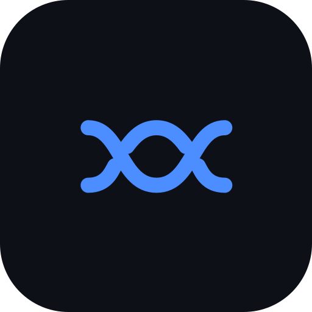
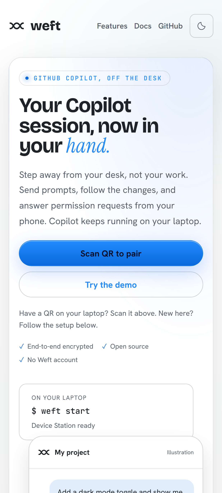
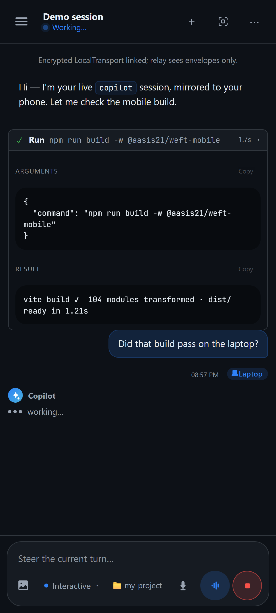
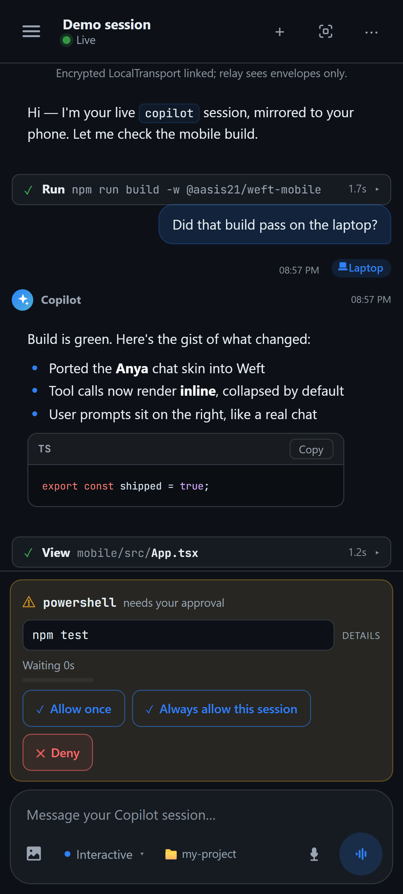
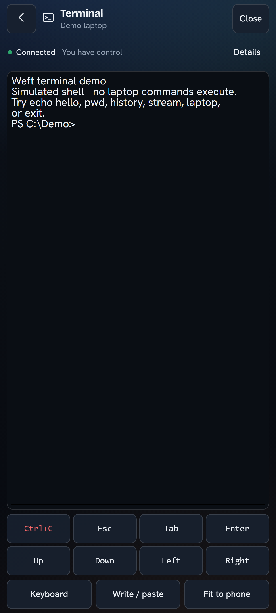

<div align="center">



# Weft

### Your GitHub Copilot session, off the desk.

[](https://github.com/aasis21/weft/actions/workflows/ci.yml)
[](https://github.com/aasis21/weft/releases/latest)
[](LICENSE)
[](#develop-locally)
[](https://useweft.netlify.app)

Weft turns your phone into a secure control surface for GitHub Copilot CLI. Follow live
work, send prompts, approve tool calls, resume sessions, and open a shared terminal while
the actual process keeps running on your laptop.

[**Open the app**](https://useweft.netlify.app) ·
[**Read the docs**](https://aasis21.github.io/weft/) ·
[**Try the in-browser demo**](https://useweft.netlify.app/) ·
[**View releases**](https://github.com/aasis21/weft/releases)

<br>

<table>
  <tr>
    <td width="50%" align="center">
      
    </td>
    <td width="50%" align="center">
      
    </td>
  </tr>
</table>

</div>

## Why Weft

| Stay in the loop | Stay in control | Stay private |
|---|---|---|
| Watch replies, tool calls, edits, and status stream live. | Prompt, steer, stop, change mode, and answer native approvals from your phone. | Session traffic is encrypted end to end; the relay forwards ciphertext and stores no session content. |
| Resume existing work or launch a session in a registered project. | Use voice, image attachments, clipboard tools, keep-awake controls, and a shared terminal. | Pairing keys, transcripts, and session metadata remain on your devices. |

Weft is not a remote desktop and it does not move your workspace to the cloud. Copilot and
your tools continue to run under your account on the laptop; the phone provides a focused,
mobile-first interface to that work.

## Install in under a minute

Install the prebuilt extension and Device Station. No repository clone, mobile app-store
download, or relay account is required.

```powershell
# Windows (PowerShell)
irm https://useweft.netlify.app/install.ps1 | iex
```

```bash
# macOS / Linux
curl -fsSL https://useweft.netlify.app/install.sh | bash
```

Start the Device Station:

```shell
weft start
```

Then open **[useweft.netlify.app](https://useweft.netlify.app)** on your phone, choose
**Scan QR to pair**, and scan the code shown in the terminal. Leave `weft start` running
while you use the phone.

> **Already paired?** Run `weft start` normally. Use `weft start --new-device` only when
> replacing the trusted phone or after clearing the phone browser's storage.

## Product tour

<table>
  <tr>
    <td width="33%" align="center">
      <br>
      <strong>Inspect the work</strong><br>
      <sub>Tool activity, output, Markdown, and code stay readable on a small screen.</sub>
    </td>
    <td width="33%" align="center">
      <br>
      <strong>Approve deliberately</strong><br>
      <sub>Native Copilot permission requests remain pending until you answer.</sub>
    </td>
    <td width="33%" align="center">
      <br>
      <strong>Use the real terminal</strong><br>
      <sub>Reconnect to one visible laptop shell with mobile-sized controls.</sub>
    </td>
  </tr>
</table>

## Core capabilities

- **Live Copilot sessions** — stream replies and tool calls, send follow-ups, attach up to
  six images, and use Vox for hands-free prompting.
- **Native approval relay** — allow once, allow for the session, or deny the exact action
  Copilot requested.
- **Session control** — stop an active turn, queue the next instruction, use supported slash
  commands, and switch between interactive, plan, and autopilot modes.
- **Multi-device workspace** — use one phone to move among paired laptops, registered
  projects, and active or historical sessions.
- **Safe launch recovery** — reconnect to slow Start and Resume operations instead of
  silently creating duplicate Copilot processes.
- **Shared terminal** — open and resume one real shell on supported Windows laptops. See
  [terminal controls and access boundaries](docs/terminal.md).
- **Explore between turns** — use compact header tiles for Discover, Watch, Play, and
  Unwind while real assistant and tool activity rolls through the bottom Copilot dock.
  Discover provides a balanced animated swipe deck of 50 offline cards, alongside two
  lightweight games, guided rest activities, and an optional explicitly loaded
  third-party short-video widget.

## Trust model

- **AES-256-GCM end-to-end encryption.** Pairing uses ECDH and a fresh handshake nonce.
- **Content-free relay.** Supabase Realtime or a self-hosted Dev Tunnel carries encrypted
  envelopes without storing session content.
- **Local continuity.** Device configuration and persistent pairing material live under
  `~/.weft/`; phone session data remains in local device storage.
- **Explicit authority.** The phone receives the same approval boundaries exposed by the
  underlying Copilot session. Weft does not invent an automatic approval policy.
- **Explore stays local by default.** The live Copilot dock projects data already present
  in the active encrypted session, while the shuffled Discover deck, reading progress,
  Play, Unwind, and scores remain on the phone. Attention states return to the canonical
  chat controls. The optional Watch provider loads only after an explicit tap and receives
  no Weft prompt, repository, filename, tool, or session context.

Read the full [security model](docs/security.md), [privacy policy](PRIVACY.md), and
[pairing protocol](docs/pairing.md).

---

## Architecture

### Session activation contract

- Every dormant Copilot extension publishes one small user-local presence record and holds one
  idle local lifecycle endpoint. It performs no remote/network access, pairing cryptography, QR
  work, logging, diagnostics, polling, heartbeat, retry timer, or other timer.
- Filesystem state provides discovery and crash recovery; the Windows named pipe or Unix-domain
  socket provides authenticated live commands such as activate, status, controller replacement,
  and quiesce. Station connects only for a command and then disconnects.
- After pairing, prompts, events, approvals, streaming, and terminal traffic flow directly between
  the phone and session over the encrypted relay. Active phone traffic does not pass through Device
  Station or the local lifecycle endpoint.
- `/clear` ends the current phone attachment. The replacement Copilot session starts dormant and
  requires fresh activation through Station or `/weft`.
- Completed lifecycle operations and unclaimed recovery identities are retained for three days,
  unless still referenced by a live runtime or unresolved operation.
- A confirmed takeover of a responsive runtime replaces the current phone controller immediately
  without restarting Copilot. Restart-and-Resume is reserved for a separately confirmed,
  revalidated unresponsive-owner flow.

```
+------------------------------+        +------------------------------+        +-------------------------------+
| Weft Mobile                  |        |   Encrypted relay            |        |  Laptop terminal              |
| (React PWA + Capacitor)      |        |   Supabase or Dev Tunnel     |        |  copilot (parent)             |
|                              |        |   private:weft:<channelId>   |        |   └─ extension.mjs (child)    |
|  • scans QR (channel + grant)|  WSS   |   • in-memory pub/sub        |  WSS   |   • joinSession()             |
|  • ECDH → AES-256-GCM        | <----> |   • zero DB persistence      | <----> |   • onPermissionRequest→relay |
|  • decrypts token stream     |        |   • RLS-gated private chan   |        |   • on(assistant.message)→push|
|  • native-style approval UI  |        |                              |        |   • session.send(phone prompt)|
|  • prompt + mode controls    |        |                              |        |   • QR via session.log()      |
+------------------------------+        +------------------------------+        +-------------------------------+
        all payloads E2E-encrypted; Supabase sees ciphertext only
```

Three layers, one monorepo:

| Workspace | What it is |
|---|---|
| `extension/` | The Copilot CLI extension (`joinSession`) + a local test **harness** that mimics the phone with no Supabase needed. |
| `shared/` | Contracts imported by **both** ends: message schema, E2E crypto (ECDH→AES-GCM), and pluggable local, Supabase, and WebSocket relay transports. |
| `mobile/` | React + Vite + Capacitor app shipped as the supported **PWA** ([useweft.netlify.app](https://useweft.netlify.app)), with in-browser camera QR scanning and an Android development shell. |

### Design principles
- **Approval = pure relay of native Copilot behavior.** The extension forwards the *native*
  permission prompt to the phone via `onPermissionRequest` and resolves with the user's tap. No
  custom policy or automatic decision timeout; the prompt stays pending until answered or the
  session ends.
- **Content-free relay storage.** Relay infrastructure forwards encrypted envelopes and
  does not store session content. Providers may still process ordinary connection metadata
  such as IP addresses, timestamps, and channel identifiers.
- **End-to-end encrypted.** The QR carries the laptop public key plus a short-lived,
  single-use pairing grant; ECDH + a fresh handshake nonce derives the AES-256-GCM key.
  Supabase only ever sees ciphertext.
- **Local continuity.** The phone stores session metadata, transcript history, preferences,
  and pairing keys locally. Persistent Device Station keys and configuration stay under
  `~/.weft/` on the laptop. Removing a session deletes its locally cached phone transcript.
- **stdout is sacred.** The CLI reserves stdout for JSON-RPC; all extension UX uses
  `session.log()`.

---

## Runtime & packaging model

- The extension is authored in `extension/src/` and bundled (esbuild) to a single
  `extension/dist/extension.mjs` plus the lazily imported `extension/dist/activeRuntime.mjs`.
  `@github/copilot-sdk` is marked **external** (the CLI provides
  it at runtime); everything else (e.g. `@supabase/supabase-js`, `shared/`) is bundled in.
- Install copies `extension/dist/` into `~/.copilot/extensions/weft/`, where Copilot CLI
  auto-discovers it (see `setup.*` / `install.*`) — that directory holds installed **code
  only**. All user config lives separately in `~/.weft/`: `weft.config.json` (registered
  projects, transport choice, device name) and `supabase.json` (relay URL + anon key). There
  is no `.env` / env-var override — reinstalling or rebuilding never touches either file, so
  your chosen transport always survives. Crypto uses Web Crypto — no native deps.
- For local development you do **not** need to install into `~/.copilot`: run the **harness**
  (`extension/harness/`) which drives the extension logic against `LocalTransport`.

---

## Develop locally

Source builds require **Node.js 20 or newer**.

```sh
npm install --workspaces --include-workspace-root  # resolve shared, extension, and mobile
npm test -w @aasis21/weft-shared            # crypto + pairing + transport + message tests
node extension/harness/harness.mjs --auto   # full relay loop vs a simulated phone (no Supabase)
npm run build -w @aasis21/weft-extension    # bundles -> extension/dist/extension.mjs + activeRuntime.mjs
npm run build -w @aasis21/weft-mobile       # Vite production build
cd mobile && npm run dev                    # then pick "Demo / Simulator"
node design/capture.mjs                     # refresh product screenshots from the hosted app
```

See [`docs/setup.md`](docs/setup.md) for the full developer guide.

| Doc | What |
|---|---|
| [`docs/setup.md`](docs/setup.md) | install, verify, run, and Supabase wiring |
| [`docs/advanced.md`](docs/advanced.md) | `/weft`, transports, pairing modes, and command reference |
| [`docs/pairing.md`](docs/pairing.md) | the ECDH pairing handshake |
| [`docs/security.md`](docs/security.md) | threat model & cryptography |
| [`docs/mode-switching.md`](docs/mode-switching.md) | runtime interactive/plan/autopilot switching |
| [`docs/hosting.md`](docs/hosting.md) | public instance vs self-hosting; operating a relay |
| [`docs/releases.md`](docs/releases.md) | supported PWA, checksums, and laptop updates |
| [`CHANGELOG.md`](CHANGELOG.md) | notable user-facing changes by release |
| [`CONTRIBUTING.md`](CONTRIBUTING.md) | development and pull-request guidance |
| [`PRIVACY.md`](PRIVACY.md) | what is stored locally and what the relay can observe |
| [`SECURITY.md`](SECURITY.md) | supported releases and private vulnerability reporting |
| [`SUPPORT.md`](SUPPORT.md) | troubleshooting and issue-reporting checklist |

---

## Testing

`npm test` at the root fans out to every workspace. Tests come in two tiers that answer
**different questions**, so a change is proven where it's cheapest and most reliable:

| Tier | Runner | Lives in | Answers |
|---|---|---|---|
| **Contracts + extension** | `node:test` | `shared/**/*.test.mjs`, `extension/**/*.test.mjs` | Is the crypto / pairing / transport / message protocol and the extension relay logic correct? |
| **Mobile unit + scenario** | **Vitest** + jsdom | `mobile/src/**/*.test.{ts,tsx}` | Is the *logic* right for a given message / timer / edge — fast, deterministic, fully mocked? |
| **Mobile real-browser e2e** | **Playwright** | `mobile/tests/*.spec.ts` | Does the *real production build* render, scroll, and navigate for a user? |

**What goes where (mobile):**
- **Vitest = breadth.** The exhaustive scenario matrix — join, resume-dedupe, remove→re-join,
  network drop→catch-up, state snapshot, approvals, elicitations, streaming, the 20s/30s heartbeat
  watchdog, persistence-across-restart — drives the **real `SessionManager`** through a mocked
  transport (`FakeWeftClient`) with fake timers, so no network, crypto, or Supabase is touched. Plus
  pure-logic (`reduceTimeline`, `sessions`, `transcripts`, `storage`) and React component tests (RTL).
- **Playwright = depth.** A few *bigger journeys* against `dist/` in a real phone viewport (412×915),
  driven by the in-app demo simulator: `journey-connect` (Landing→Join→Session navigation),
  `journey-stream` (a live streaming turn), `journey-session-management` (drawer + leave-confirm +
  routing), and `journey-smoke` (production boot + layout). It answers what only a real browser can.
- **Not automated (manual):** the real Supabase relay + real WebCrypto E2E + real cross-device
  pairing. Vitest mocks the transport; Playwright uses the demo. Neither hits the network.

```sh
npm test                                   # all workspaces: shared + extension + mobile
npm test -w @aasis21/weft-mobile           # just the mobile Vitest unit/scenario suite
npm run coverage -w @aasis21/weft-mobile   # mobile coverage table (report-only, no gate)
npm run test:e2e -w @aasis21/weft-mobile   # build dist/ + run the Playwright journeys
```

---

## Releases, support, and security

- Releases and changelogs: <https://github.com/aasis21/weft/releases>
- Update the laptop installation: `weft update --check`, then `weft update`
- General questions and reproducible bugs: [`SUPPORT.md`](SUPPORT.md)
- Sensitive vulnerability reports: [`SECURITY.md`](SECURITY.md)
- Data handling: [`PRIVACY.md`](PRIVACY.md)

## License

[Apache-2.0](LICENSE) — permissive, with an explicit patent grant and trademark
reservation; see [`NOTICE`](NOTICE) for attribution. Operating a hosted relay is a
separate concern from the code license — see [`docs/hosting.md`](docs/hosting.md) and
[`TERMS.md`](TERMS.md).
